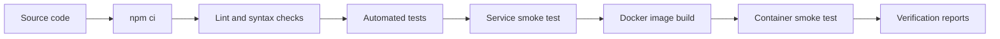

# Jenkins CI/CD Pipeline for a Containerized Node.js Service

This repository is a reproducible CI/CD reference implementation for a small Node.js HTTP service. It demonstrates how source code moves through automated validation, a Jenkins pipeline, Docker image creation, container health verification, and archived verification output.

The project is intentionally compact. It is not a production deployment platform, and it does not publish images to a registry or deploy to a live environment.

## Engineering Problem

A delivery pipeline should catch basic defects before packaging, produce a repeatable runtime artifact, and verify that artifact in the same form it would be deployed. This project shows that flow with minimal moving parts:



## Key Technologies

- Node.js 22 using the built-in `http` module and `node:test`.
- Jenkins Declarative Pipeline.
- Docker and Docker Compose.
- GitHub Actions as a secondary CI runner.
- npm lockfile-based dependency installation.

## Pipeline Stages

| Stage | What it verifies |
| --- | --- |
| Checkout | Source is retrieved from Git. |
| Runtime Diagnostics | Node.js and npm versions are recorded in build logs. |
| Install Dependencies | `npm ci` installs from `package-lock.json`. |
| Static Analysis | Repository hygiene and JavaScript syntax checks pass. |
| Automated Tests | Endpoint and response behavior tests pass. |
| Smoke Test | The service starts locally and key endpoints respond. |
| Build Container Image | Docker builds the runtime image. |
| Verify Container Image | The built image runs and responds through Docker port publishing. |
| Security Audit | `npm audit` checks production dependencies. |
| Archive Verification Reports | Smoke-test output is archived when available. |

## Local Setup

Requirements:

- Node.js 22 or newer.
- npm 10 or newer.
- Docker Desktop or Docker Engine for container checks.

Install dependencies:

```bash
npm ci
```

Run the service:

```bash
npm start
```

Useful endpoints:

- `GET /health`
- `GET /ready`
- `GET /api/pipeline`
- `GET /api/version`

## Runtime Contract

All endpoints return JSON, disable response caching, and include browser-safety headers. A valid caller-supplied `X-Request-Id` is returned in the response; otherwise the service generates one for request-to-log correlation.

`GET` and `HEAD` are supported. `HEAD` returns the same status and headers without a response body. Endpoint paths also accept a trailing slash.

`/health` reports liveness metadata, while `/ready` indicates that the service is ready to receive traffic. Both `/health` and `/api/version` include the build revision when `GIT_COMMIT` or `COMMIT_SHA` is available.

## Local Validation

Run the full non-Docker validation:

```bash
npm run ci
```

Run individual checks:

```bash
npm run lint
npm test
npm run smoke
npm run audit
```

Build and verify the Docker image:

```bash
npm run docker:build
npm run smoke:container -- jenkins-cicd-pipeline:local
```

On Windows PowerShell, use `npm.cmd` if local execution policy blocks the `npm` shim.

## Jenkins

The Jenkins pipeline is defined in [Jenkinsfile](Jenkinsfile). Jenkins setup notes are in [docs/JENKINS_SETUP.md](docs/JENKINS_SETUP.md).

Set `BUILD_CONTAINER=false` on agents that do not have Docker access. With Docker enabled, the pipeline builds the image and runs the container smoke test.
Builds are stopped after 20 minutes to prevent stuck agents.

## Docker Usage

Build and run directly:

```bash
docker build -t jenkins-cicd-pipeline:local .
docker run --rm -p 3000:3000 jenkins-cicd-pipeline:local
```

Run through Compose:

```bash
docker compose up --build
```

Set `HOST_PORT` to use a host port other than `3000`.

The Compose service runs with a read-only root filesystem, a writable in-memory `/tmp`, and `no-new-privileges` enabled. The image itself runs as the built-in non-root `node` user.

## Repository Structure

```text
.
|-- Jenkinsfile
|-- Dockerfile
|-- docker-compose.yml
|-- package.json
|-- src/
|-- test/
|-- scripts/
|-- docs/
`-- .github/workflows/ci.yml
```

## Design Decisions and Limitations

- The service uses Node.js built-in modules to keep the runtime dependency graph small.
- The custom lint script performs repository hygiene and JavaScript syntax checks without adding a formatter or linter dependency.
- Docker images are built and verified locally, but they are not pushed to a container registry.
- Smoke-test reports retain endpoint status and request identifiers; failed local smoke tests also write a failure report before exiting.
- Docker Compose is used only for local runtime verification, not as a production deployment target.
- The Jenkinsfile was written for a Node.js-capable Jenkins agent with optional Docker access.

## License

This project is released under the [MIT License](LICENSE).
