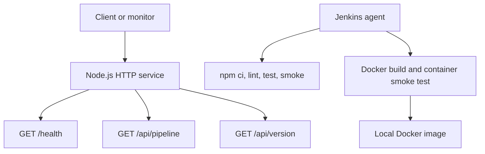

# Architecture

This project centers on a small HTTP service and the checks needed to package it safely as a container image.

## Runtime Components

## Service Responsibilities

| Endpoint | Purpose |
| --- | --- |
| `GET /` | Lists service metadata and available endpoints. |
| `GET /health` | Returns operational health, version, uptime, timestamps, and commit metadata when available. |
| `GET /api/pipeline` | Describes the CI/CD stages represented by the project. |
| `GET /api/version` | Returns package and Node.js runtime information. |

Unsupported methods return `405`, and unknown paths return `404`.

## CI/CD Responsibilities

| Area | Implementation |
| --- | --- |
| Dependency management | `npm ci` installs from `package-lock.json`. |
| Static analysis | `scripts/lint.js` checks text hygiene and JavaScript syntax. |
| Automated tests | Node.js built-in test runner validates endpoint behavior. |
| Service smoke test | `scripts/smoke-test.js` starts the service and checks live endpoints. |
| Container packaging | Dockerfile builds a small Node.js runtime image. |
| Container smoke test | `scripts/container-smoke-test.js` runs the built image and verifies live endpoints through Docker. |
| Secondary CI | GitHub Actions runs the same package scripts and Docker verification path. |

## Deployment Model

The repository stops at a locally verified Docker image. There is no registry push, cloud deployment, or production release target. A real deployment extension would add a registry login, image push, environment-specific configuration, and a deployment command for the chosen platform.
